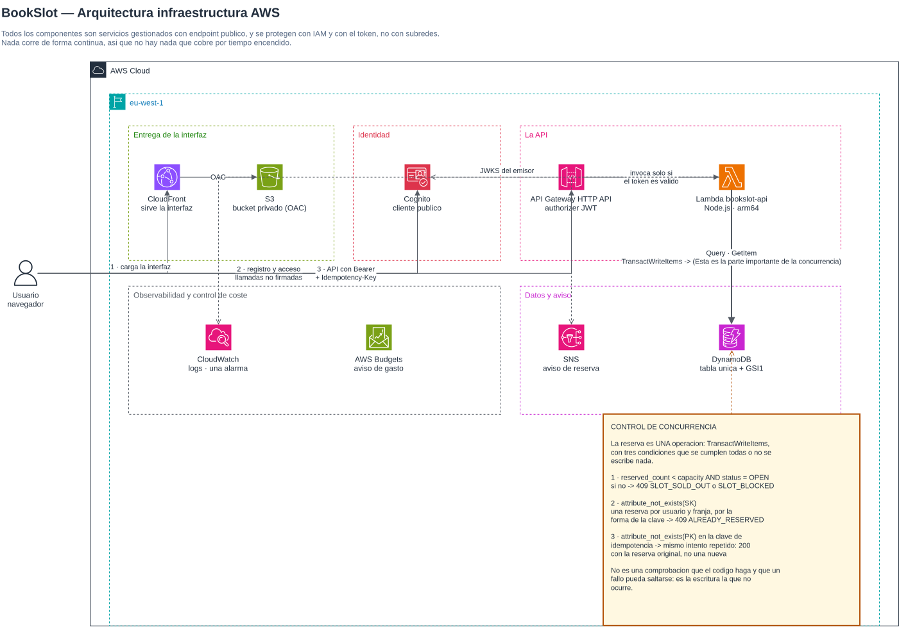

# bookslot-app
Bookslot app

Plataforma de reservas con aforo limitado sobre AWS, desplegada íntegramente con Terraform.

El requisito central es que no se pueda vender la misma plaza dos veces: con N peticiones simultáneas sobre M plazas se confirman exactamente M reservas y el resto recibe 409 SLOT_SOLD_OUT. Todo lo demás del proyecto existe para sostener esa garantía y para demostrarla.

Proyecto académico. Arquitectura serverless: no hay servidores que administrar y el coste no depende del tiempo que la infraestructura lleve creada.

1. Descripción funcional
Un administrador publica recursos (una sala, una clase, una mesa) y, para cada uno, franjas horarias con un aforo. Cualquier visitante puede consultar el catálogo y las plazas disponibles sin registrarse. Un usuario registrado reserva una plaza en una franja y puede cancelarla.

Reglas de negocio:

Una franja no admite más reservas que su aforo, ni con peticiones simultáneas.
Un usuario tiene como máximo una reserva activa por franja.
Una franja cerrada no admite reservas.
Reintentar la misma petición de reserva no crea una segunda: el cliente envía una cabecera Idempotency-Key y una repetición devuelve la reserva original.
Cancelar libera la plaza inmediatamente.
Dos perfiles:

Perfil	Puede
Visitante	Consultar recursos y franjas con su disponibilidad
Usuario registrado	Reservar, ver sus reservas, cancelar, editar su perfil
Administrador	Todo lo anterior, más crear recursos y franjas
La interfaz es una única aplicación web con los dos paneles —usuario y administración— y navegación por rutas hash.

2. Arquitectura

