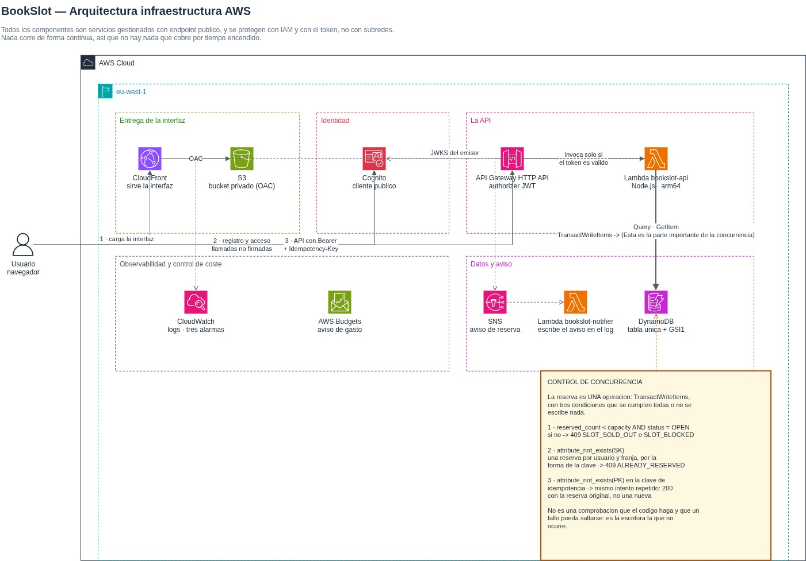

# bookslot-app
Bookslot app

Plataforma de reservas con aforo limitado sobre AWS, desplegada íntegramente con Terraform.

El requisito central es que **no se pueda vender la misma plaza dos veces**: con N peticiones simultáneas sobre M plazas se confirman exactamente M reservas y el resto recibe `409 SLOT_SOLD_OUT`. Todo lo demás del proyecto existe para sostener esa garantía y para demostrarla.

Proyecto académico. Arquitectura *serverless*: no hay servidores que administrar y el coste no depende del tiempo que la infraestructura lleve creada.

---

## 1. Descripción funcional

Un administrador publica **recursos** (una sala, una clase, una mesa) y, para cada uno, **franjas horarias con un aforo**. Cualquier visitante puede consultar el catálogo y las plazas disponibles sin registrarse. Un usuario registrado reserva una plaza en una franja y puede cancelarla.

**Reglas de negocio:**

- Una franja no admite más reservas que su aforo, ni con peticiones simultáneas.
- Un usuario tiene como máximo una reserva activa por franja.
- Una franja cerrada no admite reservas.
- Reintentar la misma petición de reserva no crea una segunda: el cliente envía una cabecera `Idempotency-Key` y una repetición devuelve la reserva original.
- Cancelar libera la plaza inmediatamente.

**Tres perfiles:**

| Perfil | Puede |
|---|---|
| Visitante | Consultar recursos y franjas con su disponibilidad |
| Usuario registrado | Reservar, ver sus reservas y cancelar |
| Administrador | Todo lo anterior, más crear recursos y franjas |

La interfaz es una única aplicación web con los dos paneles —usuario y administración— y navegación por rutas *hash*.

---

## 2. Arquitectura



| Componente | Servicio | Función |
|---|---|---|
| Entrega de la interfaz | S3 + CloudFront | HTTPS sobre un *bucket* privado, accesible solo por OAC |
| Identidad | Amazon Cognito | Custodia las contraseñas y emite el JWT |
| Entrada a la API | API Gateway HTTP API | Valida el JWT con un *authorizer* nativo antes de invocar la función |
| Lógica | AWS Lambda (Node.js, arm64) | Un fichero, sin dependencias y sin paso de compilación |
| Datos | Amazon DynamoDB | Una sola tabla con un índice global; aquí se decide la plaza |
| Copias de seguridad | PITR de DynamoDB | 35 días con granularidad de segundo |
| Aviso de reserva | SNS + Lambda notificadora | Correo al cliente al confirmar y al cancelar (se simula en el log de CloudWatch, lo ejecuta una lambda ya que no se puede utilizar Amazon SES por restricciones de cuenta) |
| Observabilidad y coste | CloudWatch + AWS Budgets | Logs, métricas, **tres alarmas** y control de gasto |

### API Gateway
 
Una **HTTP API**, no una REST API: cuesta unas tres veces menos por petición y trae *authorizer* JWT nativo, así que la firma, el emisor, la audiencia y la caducidad se comprueban **antes** de invocar la función.
 
Las rutas se declaran una a una y no con un comodín `$default`, porque el authorizer se asigna **por ruta**: es lo que permite que el catálogo sea público y el resto exija token.
 
| Ruta | Acceso |
|---|---|
| `POST /register` · `GET /resources` · `GET /resources/{resourceId}` · `GET /slots` | Público |
| `POST` · `GET /reservations` · `DELETE /reservations/{slotId}` | Token válido |
| `POST /admin/resources` · `POST /admin/slots` | Token válido + grupo `admins` |
 
El gateway autentica; que el usuario sea administrador lo decide la función leyendo `cognito:groups`.

### DynamoDB

Una sola tabla, `bookslot`, con un índice global. Modo **on-demand** (no hay capacidad que dimensionar) y **PITR activado**, que es el requisito de backups.

| Item | PK | SK | GSI1PK | GSI1SK |
|---|---|---|---|---|
| **Recurso** | `RESOURCE#<rid>` | `META` | `RESOURCES` | `<name>` |
| **Franja + aforo** | `SLOT#<sid>` | `META` | `RESOURCE#<rid>` | `<startsAt>` |
| **Reserva** | `SLOT#<sid>` | `RES#<uid>` | `USER#<uid>` | `<createdAt>` |
| **Idempotencia** | `IDEM#<uid>#<key>` | `IDEM` | — | — |


---

## 3. Decisión arquitectónica

**La decisión: serverless gestionado, sin red propia.** API Gateway, Lambda y DynamoDB. Simplifica la construcción de la infraestructura y reduce los costes, aprox. de ~200€ a ~1€ al mes (Lo que es la infraestructura sin tener en cuenta el volumen).

**Por qué:**

1. **La garantía de aforo se simplifica con DynamoDB.** `TransactWriteItems` de DynamoDB da una operación ACID con condiciones sobre varios items. La alternativa relacional exigía una transacción de dos sentencias, un índice único parcial, una restricción `CHECK` y traducir el código de error de PostgreSQL leyendo el nombre de la restricción en el texto del mensaje. Menos piezas para la misma garantía.
2. **La superficie de infraestructura se reduce a un tercio.** Desaparecen la VPC, tres capas de subredes, los NACL, los *security groups*, el NAT Gateway, el balanceador interno, el VPC Link, el registro de imágenes y el clúster de contenedores. Todos existían para aislar la base de datos, no para dar función.
3. **El coste deja de depender del tiempo encendido.** Sin instancias ni contenedores en marcha, no hace falta destruir la infraestructura entre sesiones de trabajo para no pagarla.
4. **No hay artefacto que construir.** La función es un fichero que Terraform empaqueta durante el `apply`, así que el despliegue no depende de una compilación previa ni de publicar una imagen.

**Qué se pierde:**

- **DynamoDB no es SQL.** Cada consulta tiene que estar prevista en el diseño de las claves: no se puede improvisar un `WHERE` nuevo sobre datos ya escritos. 

- **La vista de disponibilidad es de consistencia eventual**, porque se lee por el índice. La reserva no va contra la tabla base con lectura consistente.
- **Algunos datos están duplicados a propósito.** La reserva guarda copia del nombre del recurso y de la hora para que el aviso no tenga que consultarlos.

### Alta disponibilidad

Aprovechando servicios serverless de forma natural se justifica como cubren la Alta disponibilidad:

| Componente | Qué pasa si cae una zona de disponibilidad |
|---|---|
| DynamoDB | Nada. Cada partición se replica de forma sincrónica en **tres** zonas y el liderazgo se traspasa solo |
| Lambda | Nada. AWS invoca la función en las zonas que quedan |
| API Gateway | Nada. El endpoint es regional |
| Cognito | Nada. Regional |
| CloudFront + S3 | Nada. CloudFront es global y S3 replica dentro de la región |

### Overbooking e Idempotencia

**Cómo se evita el overbooking, en una frase:** la reserva es una única operación `TransactWriteItems` de DynamoDB cuya condición `reserved_count < capacity` la evalúa el líder de la partición en el mismo paso indivisible en el que escribe.

No hay una comprobación previa en el código que un fallo pueda saltarse: es la propia escritura la que no se produce.

La reserva es **una sola operación transaccional** con tres condiciones que se cumplen todas o no se escribe nada:

1. quedan plazas y la franja está abierta — `reserved_count < capacity AND status = OPEN`
2. el usuario no tiene ya una reserva en esa franja — la clave del item lo impide por construcción
3. la clave de idempotencia no se había usado — un reintento devuelve la reserva original


Se comprueba a dos alturas:

| Prueba | Qué demuestra |
|---|---|
| `scripts/test/concurrency-test.sh` | N reservas simultáneas por HTTPS contra el despliegue real |
| `scripts/test/idempotency-test.sh` | 20 peticiones con la misma clave producen una sola reserva |

---

## 4. Seguridad y operación
 
**IAM con mínimo privilegio.** Al utilizar serverless se configuran los recursos con los roles de la academia, y se configura de forma que los recursos no tienen permisos ilimitados, ni nos encontramos con "*" en los servicios.
 
**Secretos fuera del código: no hay ninguno.** Los clientes se almacenan con Cognito, y los pipelines no almacenan claves de AWS.
 
**HTTPS.** Los dos puntos expuestos, CloudFront y el endpoint de API Gateway, solo aceptan HTTPS. El *bucket* no es accesible directamente: solo CloudFront, por OAC.
 
**CI/CD.** `ci.yml` corre en cada push y pull request las pruebas de la función, `terraform fmt -check`, `terraform validate` y la sintaxis de la interfaz, **sin ningún acceso a AWS**. `deploy.yml` despliega en push a `main` desde un **runner autoalojado**, sin claves almacenadas: `terraform apply`, generar `config.js` con los *outputs*, subir la interfaz e invalidar la caché.
 
**Alarmas.** Las alarmas se publican en un topic de SNS **suscrito a un correo**. Se evalúan los errores de la función, sus frenadas por límite de concurrencia y los 5xx del gateway.
 
**FinOps.** Los tags `Project`, `Environment` y `Owner` los aplica el provider con `default_tags`. **AWS Budgets** avisa por correo al superar el presupuesto mensual configurado.
 
---

## 5. Instrucciones de despliegue

**Requisitos:** AWS CLI v2, Terraform ≥ 1.10, `jq` y `uuidgen`, y credenciales de AWS con permisos sobre la cuenta.

**Linux (Debian/Ubuntu)**

```bash
sudo apt install jq uuid-runtime   
```

**MacOs**

```bash
brew install jq                    
```

### 0. Preparación

```bash
git clone https://github.com/ninoecf/bookslot-app.git
cd bookslot-app
chmod +x scripts/*.sh scripts/test/*.sh
```

Configura tus credenciales de AWS y comprueba la cuenta y la región:

```bash
aws sts get-caller-identity
aws configure get region
```

Todos los comandos parten de la raíz del repositorio y se ejecutan en la misma terminal.

### 1. El bucket del estado

```bash
./scripts/create-bucket-4-tfstate.sh bookslot-tfstate eu-west-1
```

Si el nombre está ocupado, elige otro y cámbialo en el bloque `backend` de `infra/provider.tf`.

### 2. Las variables

```bash
cd infra
cp example.tfvars terraform.tfvars
```

Edita `terraform.tfvars` y pon tu dirección en `alert_email`. Ahí llegarán las alarmas y los avisos de presupuesto.

### 3. Levantar la infraestructura

```bash
terraform init
terraform apply
```

Son 34 recursos y tarda unos minutos. Al terminar, confirma la suscripción a las alarmas desde el correo que envía AWS.

### 4. Publicar la interfaz

```bash
cat > ../web/config.js <<EOF
window.BOOKSLOT_CONFIG = {
  apiBaseUrl: "$(terraform output -raw api_invoke_url)",
  userPoolId: "$(terraform output -raw cognito_user_pool_id)",
  clientId: "$(terraform output -raw cognito_client_id)"
};
EOF

aws s3 sync ../web/ "s3://$(terraform output -raw web_bucket_name)/" \
    --delete --exclude "config.example.js"

terraform output -raw web_url; echo
```

En despliegues posteriores:

```bash
aws cloudfront create-invalidation \
    --distribution-id "$(terraform output -raw cloudfront_distribution_id)" \
    --paths "/*"
```

### 5. El primer administrador

```bash
POOL=$(terraform output -raw cognito_user_pool_id)
EMAIL="admin@ejemplo.com"
CLAVE="BookSlot2026"

aws cognito-idp admin-create-user \
    --user-pool-id "$POOL" --username "$EMAIL" --message-action SUPPRESS \
    --user-attributes Name=email,Value="$EMAIL" Name=email_verified,Value=true Name=name,Value=Administrador

aws cognito-idp admin-set-user-password \
    --user-pool-id "$POOL" --username "$EMAIL" --password "$CLAVE" --permanent

aws cognito-idp admin-add-user-to-group \
    --user-pool-id "$POOL" --username "$EMAIL" --group-name admins
```

### 6. Reproducir las pruebas

```bash
cd ..

./scripts/test/seed-users.sh 10

./scripts/test/seed.sh "$EMAIL" "$CLAVE" 3 120
./scripts/test/idempotency-test.sh

./scripts/test/seed.sh "$EMAIL" "$CLAVE" 3 120
./scripts/test/concurrency-test.sh 8
```

La salida se guarda en [`docs/evidencias/`](docs/evidencias/). La cuenta limita las ejecuciones simultáneas de Lambda a 10, de ahí las 8 peticiones.

El correo de confirmación de reserva se simula en el log de la notificadora:

```bash
aws logs tail /aws/lambda/bookslot-dev-notifier --since 10m
```

### 7. Despliegue automático

`deploy.yml` repite los pasos 3 y 4 en cada push a `main`, sobre un runner autoalojado. Registro desde **Settings → Actions → Runners → New self-hosted runner**, que da la URL del paquete y un token válido durante una hora:

```bash
mkdir -p ~/actions-runner && cd ~/actions-runner

curl -o actions-runner.tar.gz -L \
  https://github.com/actions/runner/releases/download/v2.328.0/actions-runner-linux-x64-2.328.0.tar.gz
tar xzf actions-runner.tar.gz

./config.sh --url https://github.com/ninoecf/bookslot-app --token <TOKEN>
./run.sh
```

El job usa las credenciales de AWS de esa máquina.

`ci.yml` corre en runners de GitHub y no accede a AWS: sintaxis de las funciones y de la interfaz, `terraform fmt -check` y `terraform validate`.

---

## 6. Instrucciones de destrucción

```bash
cd infra
terraform destroy
```

34 recursos, unos tres minutos.

### Recursos no gestionados por Terraform

El bucket del estado. Tiene versionado, así que hay que borrar las versiones antes que el bucket:

```bash
aws s3api delete-objects --bucket bookslot-tfstate --delete "$(
    aws s3api list-object-versions --bucket bookslot-tfstate --output json \
        --query '{Objects: Versions[].{Key:Key,VersionId:VersionId}}')"

aws s3api delete-objects --bucket bookslot-tfstate --delete "$(
    aws s3api list-object-versions --bucket bookslot-tfstate --output json \
        --query '{Objects: DeleteMarkers[].{Key:Key,VersionId:VersionId}}')" 2>/dev/null || true

aws s3api delete-bucket --bucket bookslot-tfstate --region eu-west-1
```

Los grupos de logs, que crea Lambda en la primera invocación:

```bash
aws logs delete-log-group --log-group-name /aws/lambda/bookslot-dev-api
aws logs delete-log-group --log-group-name /aws/lambda/bookslot-dev-notifier
```

### Comprobación

```bash
aws cognito-idp list-user-pools --max-results 10 --query 'UserPools[].Name'
aws dynamodb list-tables --query 'TableNames'
aws s3 ls | grep bookslot
aws logs describe-log-groups --log-group-name-prefix /aws/lambda/bookslot \
    --query 'logGroups[].logGroupName'
```

---

## 7. Coste mensual estimado

Sin nada encendido por horas, el gasto depende del uso. Con el de este proyecto —despliegues, pruebas y una demostración— las líneas quedan así:

| Concepto | Estimación mensual |
|---|---|
| Lambda | 0 $ · dentro del tramo gratuito permanente (1 M de invocaciones) |
| API Gateway HTTP API | céntimos · 1,00 $ por millón de peticiones |
| DynamoDB (peticiones on-demand) | céntimos · 1,25 $ por millón de escrituras |
| DynamoDB (almacenamiento y PITR) | céntimos · el volumen de datos es de kilobytes |
| S3 + CloudFront | 0 $ · dentro del tramo gratuito permanente |
| Cognito | 0 $ · muy por debajo del umbral de usuarios activos |
| CloudWatch Logs | céntimos · según la retención configurada |
| SNS | céntimos |
| **Total** | **por debajo de 1 $/mes** |

### Escenario con tráfico real

Estimación hecha con la [calculadora oficial de AWS](https://calculator.aws/#/estimate?nc2=h_pr_calc&id=2bf144db3d84c40d04d5fe88fdd64ef9471cacd3) sobre un escenario de **50 visitas, 10 reservas y 10 registros al día** : **0,50 $/mes**. El desglose exportado está en [`docs/coste-estimado.json`](docs/coste-estimado.json).
 
De esos 0,50 $, **0,43 $ son la línea de CloudWatch computada sin la capa gratuita** —la calculadora avisa de que esa sección la excluye—, y en la práctica las diez primeras alarmas son gratis. La cifra es el techo, no el suelo.

